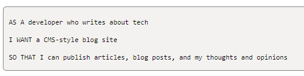
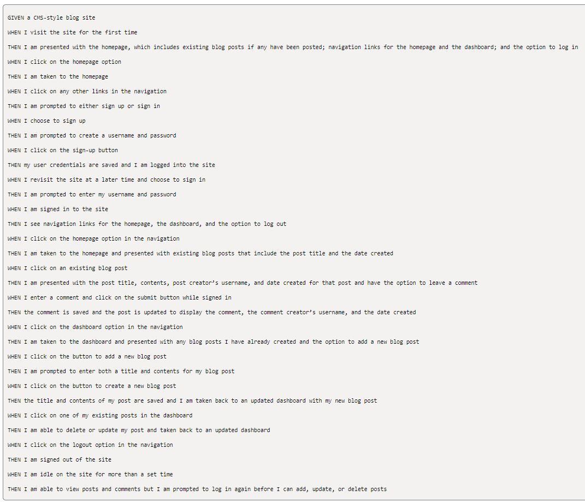

# tech-blog

This Tech Blog allows users who want to write about tech make blog posts and comments on other's posts.

## Technologies Used

* JavaScript
* Handlebars
* Node.js 
* Express
* HTML
* MySQL2
* Sequelize
* npm

## Description

The Tech Blog allows users to view all blog posts on the homepage. If the user wants to see more, they will be redirected to the login page to sign up or login. Once logged in,  the user can post blogs and add comments to individual blogs. 

## User Story

## Acceptance Criteria

## Installation

Install the following packages in the terminal:

1. Initialize the repo with a 'package.json' file by running, "npm init -y" in the command-line.
2. npm install express-handlebars  
3. npm install --save mysql2  
4. npm i sequelize  
5. npm install dotenv --save  
6. npm install bcrypt  
7. npm install express-session  
8. npm install connect-session-sequelize  
9. npm install express-session